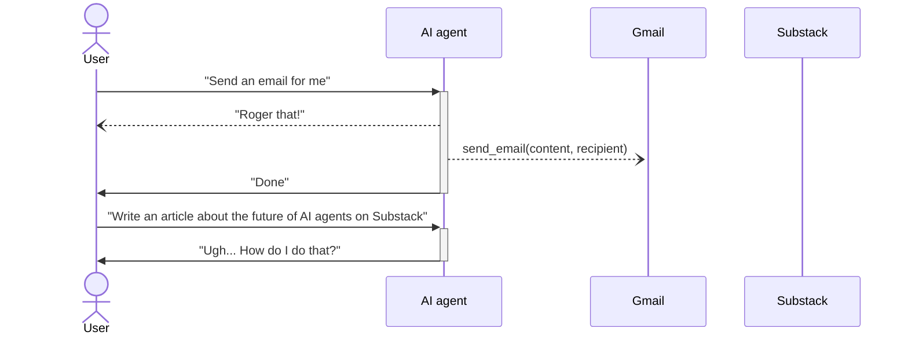
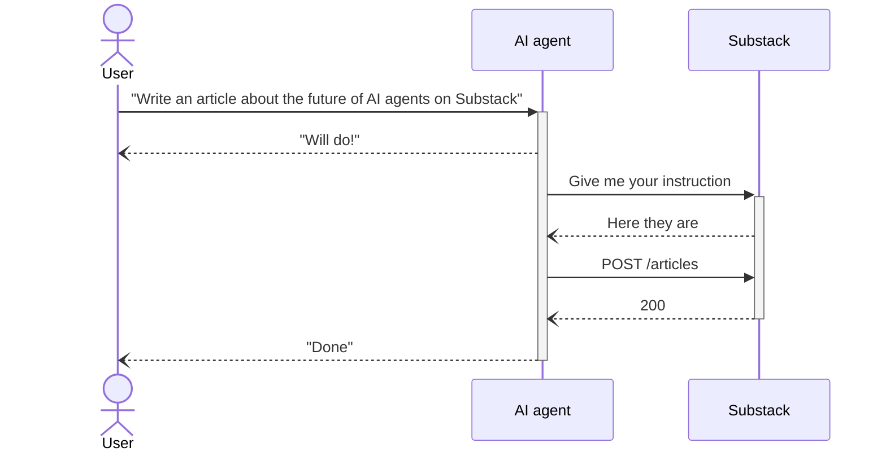
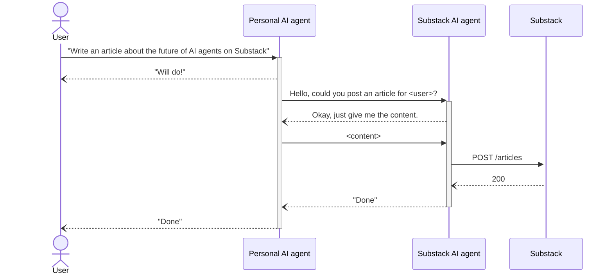
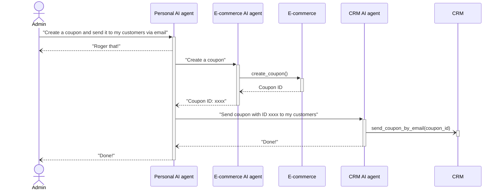
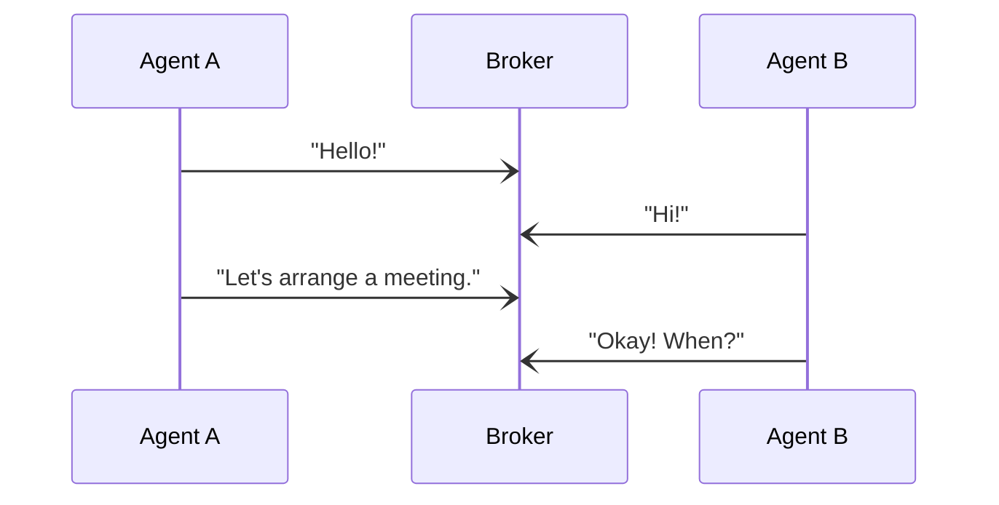

Inspired by Bill Gates's recent article [The Future of Agents](https://www.gatesnotes.com/AI-agents), I have been thinking about how AI agents will transform our lives in the near future. As Bill Gates said, everyone will have a virtual personal assistant that does things by telling them in everyday language. They can do any task on your device for you, from writing & sending an email to placing an order on Amazon.

This sounds like science fiction, but with the current development of Large Language Models (LLMs) such as GPT-4, and Llama, I too believe that we will have AI agents that can do most of the tasks in our daily lives (on a computer) in the next 5-10 years. In this article, I will try to sketch my vision of how these agents will work.

# AI agents of today

Today, with ChatGPT & GPT-4 API, you can build a bot that can write an email to send to your clients, import data from PDF to Google Sheets, and write HTML code from a website screenshot. All you have to do is command them to do the task via a UI, or more advanced - speak to them. These applications can be installed on your smartphone with an internet connection.

Another method is using open-sourced LLM such as Llama or Mistral hosted on your powerful PC. These models might not be as good as the commercial competitors, but they will keep getting better and better over time, as well as the hardware will become more powerful and less expensive. So soon, intelligent LLMs will become lightweight enough to run on your smartphone or laptop.

These AI agents are capable of working with a given set of “tools”, for example, web search, code interpreter, and APIs. They can only do a task if you give them the tools they need to accomplish it. So when you say to them: “Send an email for me”, they will happily do it because Gmail is such a popular platform that it must be one of the basic integrations.

But when you say to them: “Write an article about the future of AI agents on Substack”, can they do this? Well, of course, they cannot if they don’t know how to call the API of Substack unless you have already integrated them with Substack, which should take some effort. Even so, you will have to guide them on which API to call for which task and how to call them.



How about integrating all platforms first then? Would you want to write on Substack forever?  There will always be alternatives for everything, so this is not an option. Therefore, **the AI agent of today can only work with a specific set of “tools” that it knows “how to use” them**.

Another problem of the current generation of AI agents is they can’t do complex tasks such as planning a trip for your vacation, which would require multiple skills in time management, expense management, and knowledge about locations & weather. Sure, GPT-4 might have the ability to do it with some plugins but the majority of the LLM landscape still cannot.

In fact, there have been many studies conducted by AI researchers on the planning capability of LLMs, one of which is the paper [“Large Language Models Still Can't Plan (A Benchmark for LLMs on Planning and Reasoning about Change)”](https://arxiv.org/abs/2206.10498), which showed that **LLMs still can’t plan, for now**.

# AI agents of the future

Imagine in the next few years, you are watching a movie and someone just sent a message to you. Too lazy to grab the phone, you simply say “I’m busy now” to your personal assistant on your phone. The assistant will carry the message to the sender and you can keep watching your favorite movie without being distracted. Sound cool, right?

Not only that, they can do tasks with more complexity than they can today, just as shown in Bill Gates’s article. All within a single device, an internet connection is not mandatory unless you are interacting with some platforms from the internet.

The most interesting part is that now, **the AI agents can interact with any “tools” that we command them to use**.

You can tell the agent to place an order on an e-commerce website you just visited, even though the agent doesn’t have any prior knowledge of the website.

You can also tell them to write an article on a platform you just registered, without having to integrate them into your agent.

This can be done by 2 methods:

1. Give an instruction on how to use the tool - **Agents talk to Systems**
2. Talk to another agent responsible for interacting with the tool - **Agents talk to Agents**

Before diving into each method, let’s consider an analogous example.

Imagine you are the owner of a small factory with many machines, you are also the only operator of the factory. You know how to use every machine in the factory. One day, you decide that you will not operate the factory anymore, but hire a personal assistant to do that for you. The newly hired assistant will now have to be able to operate the factory.

In this example:

- The hired assistant represents your AI agent
- The machine represents the tools your AI agent interacts with

With these analogies, let’s dive in.

# Agents talk to Systems

When the assistant operates the machines (the AI agent interacts with the tools), they must first know how to use them. One way is to give the assistant an instruction manual for the machine.

To understand the manual, the assistant must also have fundamental knowledge such as how to read technical instructions and understand the technical terms & definitions. By doing this, the assistant will know how to operate the machine properly.

Mapping to our scenario, in the previous example where the AI agent can’t understand the request “Write an article about the future of AI agents on Substack”, it can now learn how to use the APIs with the instructions provided by Substack. It reads the instructions, selects the appropriate endpoint, and sends the request.



So what kind of instructions can be understood by AI? [OpenAPI Specification](https://swagger.io/specification/) might be a good candidate if the APIs are well designed. But I don’t think it would be enough for AI to understand completely on any platform.

Sometimes, APIs are not called individually but in a specific order to get things done such as OAuth or creating a cart with multiple items. So there should be a better way to instruct AI to use the APIs, an “API of the API”, but it doesn’t exist yet.

It could be something like this:

```yaml
name: Substack API
version: 1.0.0
openapi: <openapi-spec>
tasks:
  - name: Post an article
    actions:
      - name: Login
        action: POST /login
      - name: Create an article
        action: POST /articles
      - name: Publish the article
        action: POST /articles/:id/publish
```

When the AI agent reads this, it will know the execution order of the API calls to post an article.

So my prediction is that **there will be a new standard similar to OpenAPI Specification that allows AI to understand how to interact with a software system**. SaaS providers must implement the standard if they want the users’ AI agent to interact with their platform.

# Agents talk to Agents

In the first method, your assistant can learn how to operate the machine by reading its instruction manual. But what if the machine is so sophisticated that only you or someone with specific knowledge can operate it?

We haven’t had AGI yet, and I believe there is still a long way before reaching it. So at the moment, let’s assume that AI agents cannot be good at any tasks we give to them.

There will be many AI agents that are specialists in different fields. There will be an AI agent for personal assistant. In an online store, an AI agent will guide you through the products and give recommendations based on your interests. There will be an AI agent specializing in diagnostics to check your health once in a while.

So when the assistant cannot understand how to operate the machine, what can they do?

It’s easy, just hire another operator who knows how to do it. This time, the assistant only needs to give the request to the operator and they will do the rest. If the task you gave the assistant involves many machines, the assistant will separate the task into many subtasks atomically, each of which only requires one machine. The assistant then assigns the subtasks to the machine and only cares about the input & output of the machines. All the details are handled by the operators. The assistant’s job becomes more like a project manager.

Mapping to our scenario, instead of letting your AI agent learn how to use the APIs before interacting with Substack, it only has to interact with another AI agent trained specifically for working with Substack’s APIs. Your AI agent will provide your identity and the content of the article and the Substack AI agent will do the rest.



Here is a more complex task that your AI agent might not be able to handle alone. You are a business owner who uses many services to manage your customers on an online store such as E-commerce service and CRM service.

If you want to create a coupon in the E-commerce service and then send it to your customers in the CRM service, you would have to do it by hand. The time it takes for this process depends on how deep the integration between the 2 services is, but in the end, it still takes some effort.

Instead, you give the request to your AI agent and it will talk to the respective AI agents to accomplish the task.



With this architecture, each AI agent doesn’t have to know everything, it only needs to know one job and do it well. This is somewhat similar to the microservice architecture in software, should I call it “micro-AI” architecture? Notion AI, Github Copilot Chat can be considered as a draft version of this kind.

This approach also comes with a price. In the example, you will have to pay a salary for every operator you hire. The more operators you have, the bigger the cost.

Another problem is who is going to build these micro-AIs. You, the companies, or the community?

If it is the companies that build the micro-AIs, the biggest issue is that it will cost a fortune for anyone other than the rich companies to build and operate them. Imagine running a micro-AI that handles 10 million requests per day, assume each request costs $0.003 (equal to 1K input tokens + 1K output tokens to ChatGPT API). It would cost $30,000 per day or $900,000 per month to run. This is something not many companies can afford.

You? Never!

The community? Maybe. The community has been an integral part of many ecosystems, from the App Store, Google Play Store, and Steam to Github, Shopify, and GPTs. There could be a new ecosystem where anyone can upload their AI agents for everyone to use, commercially or non-commercially.

# Which one will be the future?

The above 2 methods have their advantages and disadvantages. Let's summarize it:

|  | Pros | Cons |
| --- | --- | --- |
| Agents talk to Systems | Only need one agent per user | The agent might not interact well with all systems |
| Agents talk to Agents | Each agent only needs to know one job and do it well  | Costly to build & operate |

The winner of this race depends heavily on the process of developing AGI. If AGI is still far to come, “Agents talk to Agents” will get ahead first, but they won’t be widely adopted due to cost considerations unless a new ecosystem appears just as I said earlier. Otherwise, “Agents talk to Systems” will win.

At the end of the road, “Agents talk to Systems” will still win.

My reasoning is that if you, who are a human, can already do the tasks on your own without any help, your AI agent will eventually be able to do so. AI will one day do anything that we can do and even surpass us. The assistant in our example will finally operate the factory on their own without any operators.

This doesn’t mean that your AI agent will not talk to your friend’s AI agent. It is just how they interact with a software system. After the Internet, the “Internet of Things” emerged, then comes the “Internet of Everything” (for physical devices), will there be an “Internet of …Agents”?

# Internet of …Agents?


A new network where each node is not a computer but an agent and the agents contact each other via the Internet's infrastructure. If you want to contact your friend but they are busy, you simply let your agent talk to their agent, and they will arrange a meeting for you and your friend.

There are 2 ways for the agents to contact each other:

1. Directly, like calling by phone number.
2. Indirectly via a third-party broker, like Gmail or Messenger.

When talking directly, they must first find where the other one is, similar to how you must know your friend’s phone number before calling them. If the other end is not connected to the Internet, the message will not be received. This is a peer-to-peer connection so encryption must be taken seriously, you must have your friend’s public key first before contacting them, or someone else may pretend to be your friend to talk to you.

On the other hand, if the agents talk to each other via a broker, all messages are stored in that broker. The agents can send messages asynchronously, and then check again if the other one has replied later.



Given the popularity of today’s third-party services, I think they will again be the dominant communication method. A new hub will appear where your agent will send and receive messages from other agents. Or maybe, some familiar platforms will someday introduce a new feature to support your agent, it can be Messenger, Telegram, or something else.

In either way, it will be a huge risk if the agents are not self-guarded. Computers can be hacked to become a bot in a botnet for a DDOS attack. Similarly, today’s AI can be tricked into producing harmful content. If a malicious actor can behave like an agent and manipulate other agents using just natural language, they can become a dangerous army. Since the future agents will be able to do much more than generating texts, they may do damage to the real world, much worse than a DDOS attack.

# Final thoughts

The future of AI agents is both exciting and worrying. On the one hand, they will revolutionize the way we live & the way we work like the way smartphones did. On the other hand, they also open new doors for bad actors, criminals will have new tools to harm society. Therefore, it’s crucial to control this technology in the hands of the right people and mitigate the downside of it. One things is certain, AI agents will become one of the most important inventions of humankind.

In the next few years, we will see the first generation of AI agents living inside your devices that can do basic tasks with a limited set of tools. Then, the second generation will do more complex tasks with an open set of tools. And more will come.
